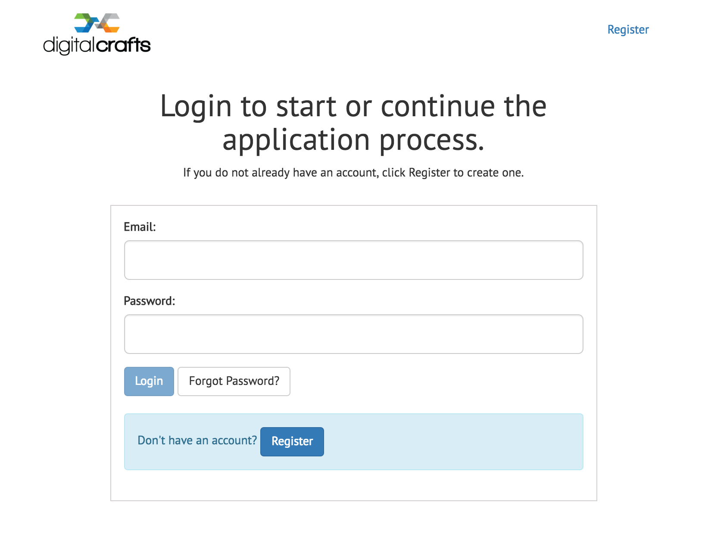
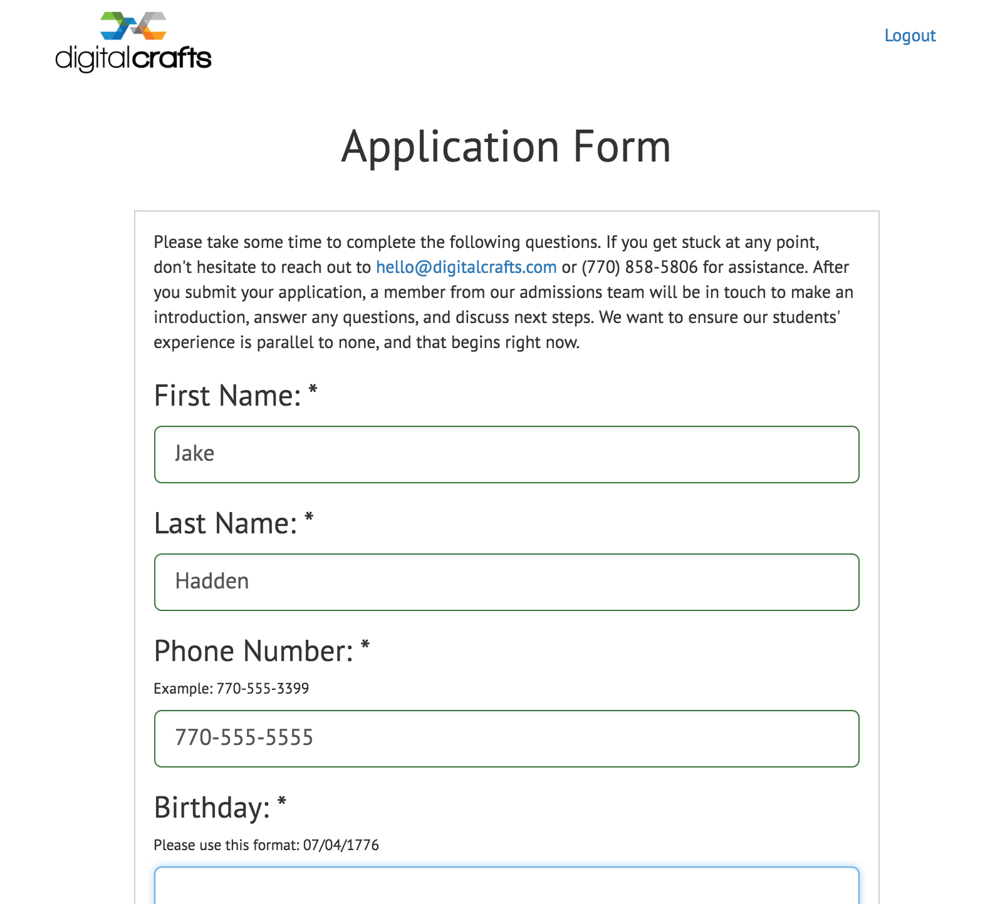
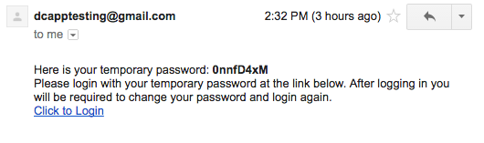
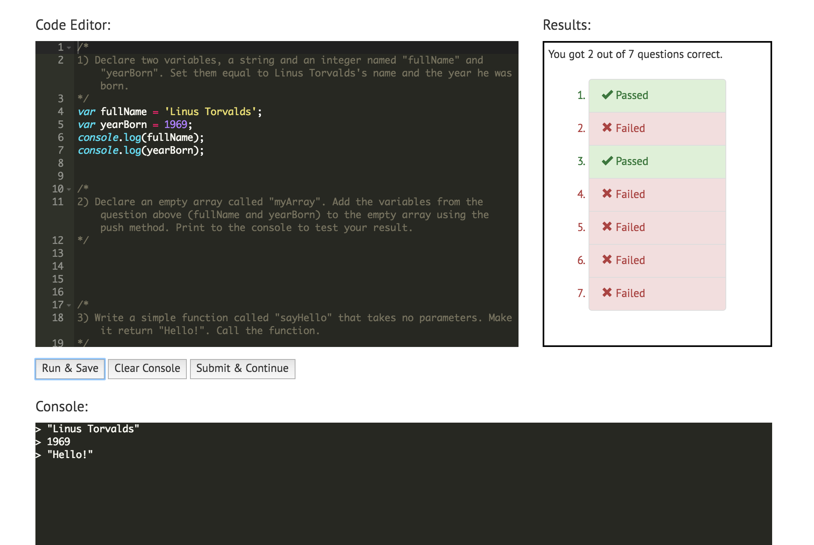
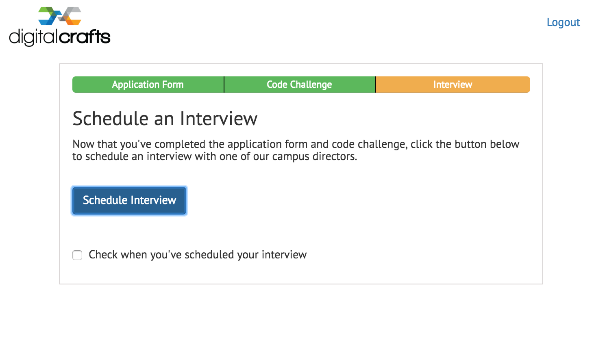
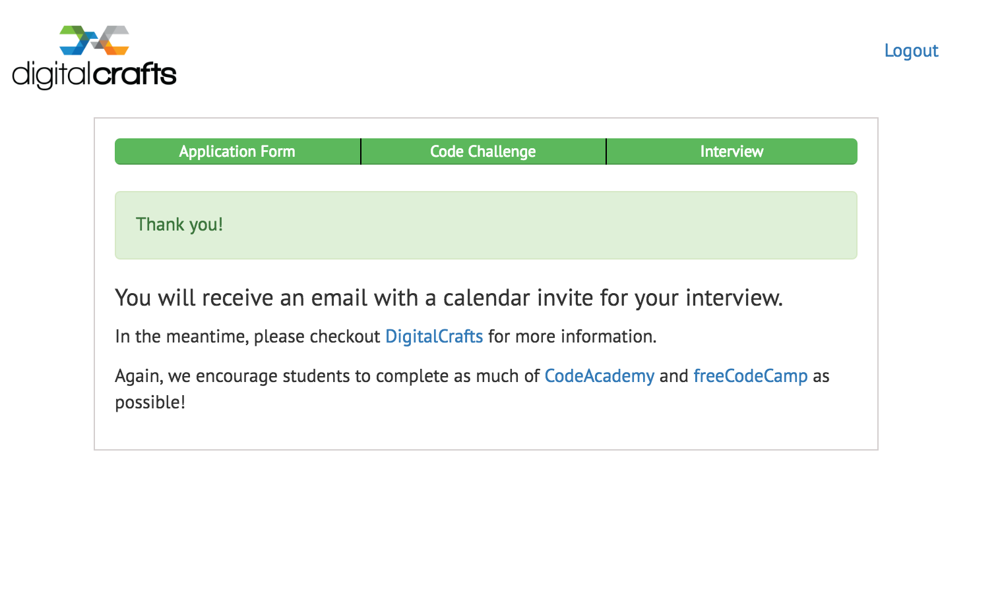
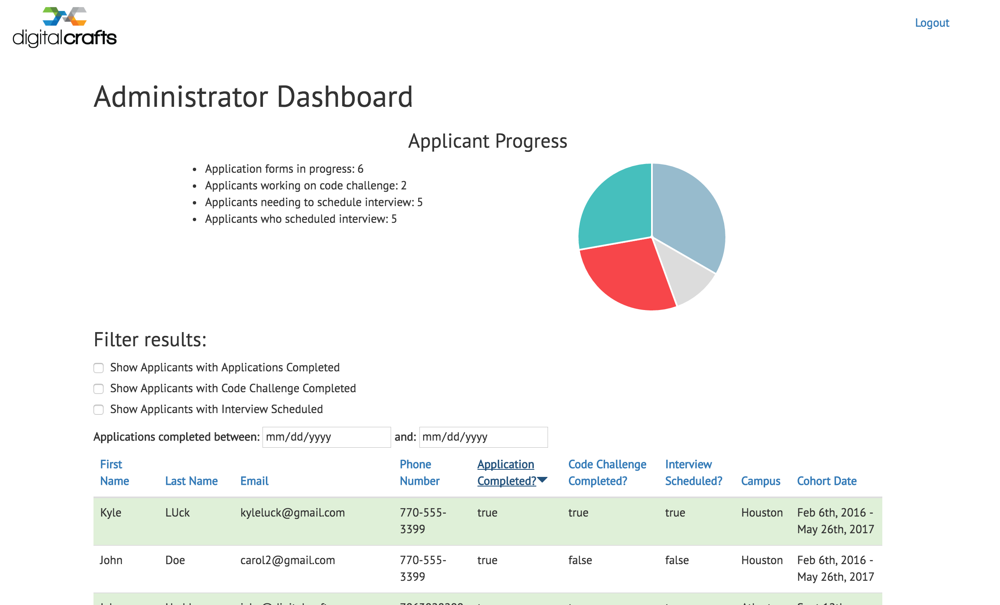

# DC Student Application

## Overview
An online application portal for DigitalCrafts. Prospective students can register for an account, login, and save their progress throughout the application process. Should the student forget their password, they can request a temporary password which will be automatically emailed to them. After the student finishes and submits the application, DigitalCrafts will be sent an email containing the application information. 

## Screenshots

Login page

Application page

Reset password email

Code challenge

Schedule Interview

Application Completed!

Administrator Dashboard

### Technologies, frameworks, & programming languages used
* JavaScript
* MongoDB
  * Application settings are stored in one collection, while user data is stored in a separate collection.
* AngularJS
  * Used to make this project a single-page application.
* Node.js
* Node modules:
  * Mongoose
  * Express
  * cors
  * busboy
    * Used to stream upload of resume.
  * body-parser
  * rand-token
    * Generating user authentication token as well as temporary password for reset password functionality.
  * my-bcrypt
    * Used to hash user passwords.
  * nodemailer
    * Used to send automated emails.
* Bootstrap
* Web workers
  * Used to run user generated code on the client side.
* Ace
  * Used to integrate a code editor into our application.
* Jasmine
  * With custom reporter to run test cases on user generated code and then display the results.

### Contributors
We utilized mob programming throughout the development of this.
* [Carolyn Daniel](https://github.com/csdaniel17)
* [Kyle Luck](https://github.com/kyleluck)
* [Matthew Brimmer](https://github.com/mbrimmer83)

### Live demo

Look for it soon on [DigitalCrafts](http://digitalcrafts.com/)!
