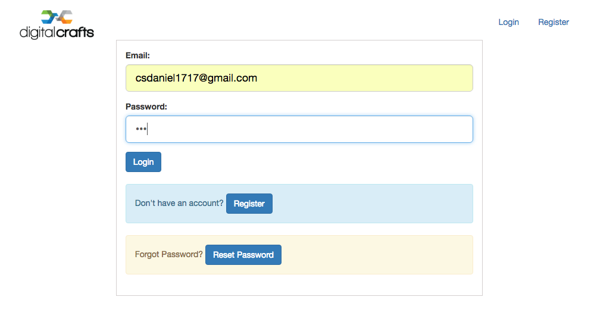
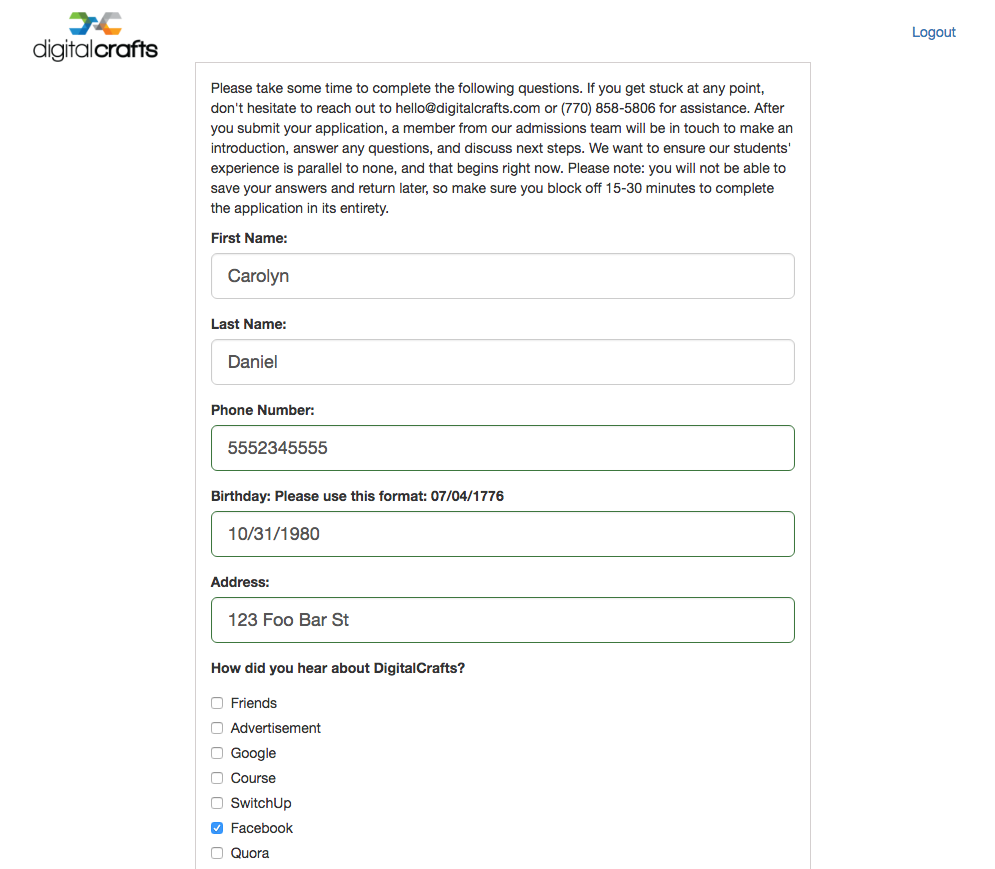

# DC Student Application

## Overview
* An online application portal for DigitalCrafts. Prospective students can register for an account, login, and save their progress throughout the application process. Should the student forget their password, they can request a temporary password which will be automatically emailed to them. After the student finishes and submits the application, DigitalCrafts will be sent an email containing the application information.

## Screenshots

* Login page

* Application page

* Reset password email page

### Technologies, frameworks, & programming languages used
* JavaScript
* MongoDB
* AngularJS
* Node.js
* Node modules
  * Mongoose
  * Express
  * cors
  * busboy
  * body-parser
  * rand-token
  * nodemailer
* Bootstrap

### Contributors
* We utilized mob programming throughout the development of this
* [Carolyn Daniel](https://github.com/csdaniel17)
* [Kyle Luck](https://github.com/kyleluck)
* [Matthew Brimmer](https://github.com/mbrimmer83)

### Live demo

Look for it soon on [DigitalCrafts](http://digitalcrafts.com/)
